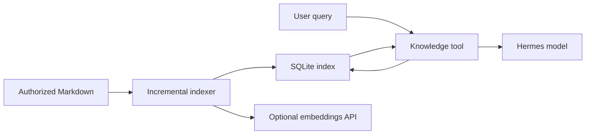

## Executive summary

The knowledge retrieval slice is local and read-only at query time, but it crosses a high-value trust boundary: operator-managed Markdown becomes model-visible context. The main risks are prompt injection in indexed notes, accidental indexing outside the authorized root, denial of service from oversized corpora or embedding calls, and leakage through returned passages. Existing path checks, hidden-file exclusion, bounded results, source citations, and content labeling materially reduce risk; the remaining priority is explicit per-root authorization and stronger content-policy enforcement before personal-vault ingestion.

## Scope and assumptions

- In scope: `knowledge/obsidian_index.py`, `tools/knowledge_search_tool.py`, `scripts/obsidian_knowledge.py`, `toolsets.py`, and their tests.
- Runtime context: a single-user Hermes gateway on a private VPS; the configured knowledge root may contain internal notes of medium sensitivity, depending on deployment.
- The index is derived state in profile-scoped SQLite, not authoritative memory.
- Out of scope: the broader Hermes tool execution model, Telegram authentication, other integrated services, model-provider security, and build/release infrastructure.
- The user did not explicitly confirm the assumptions above; risk rankings are conditional on them. Public or multi-user exposure would raise TM-001 and TM-003 to high priority.

Open questions:

- Is port 8644 restricted by firewall/reverse-proxy authentication in every deployment?
- Will personal notes or credentials ever be placed under an authorized knowledge root?

## System model

### Primary components

- Markdown roots selected by the operator (`tools/knowledge_search_tool.py::_knowledge_roots`).
- Incremental parser/indexer and SQLite FTS/vector store (`knowledge/obsidian_index.py::KnowledgeIndex`).
- Read-only model tool registered in the Hermes tool registry (`tools/knowledge_search_tool.py`).
- Operator CLI and evaluation corpus (`scripts/obsidian_knowledge.py`, `eval/knowledge.json`).

### Data flows and trust boundaries

- Operator filesystem → indexer: Markdown bytes and paths cross a file trust boundary. Canonical-path checks, symlink rejection, hidden-directory exclusion, UTF-8 decoding, and content hashing are applied.
- Indexer → SQLite: headings, parent sections, optional embeddings, hashes, and redacted query telemetry are persisted locally.
- User/model query → retrieval tool: a bounded string and result limit cross the tool-schema boundary; limit is clamped and SQL parameters are bound.
- SQLite → model context: retrieved note content crosses into the LLM as explicitly labeled untrusted evidence with citations.
- Optional OpenAI API: note/query text crosses an external-provider boundary only when `OPENAI_API_KEY` is configured.

#### Diagram

## Assets and security objectives

| Asset | Why it matters | Security objective (C/I/A) |
|---|---|---|
| Business notes | May contain operational decisions and metrics | C/I |
| Authorized-root policy | Prevents personal or secret files entering model context | I |
| SQLite index | Drives retrieval answers and citations | I/A |
| Query traces | Reveal usage patterns even without raw query text | C/I |
| Provider credentials | Permit paid external API access | C |
| Gateway availability | Retrieval must not exhaust the assistant process | A |

## Attacker model

### Capabilities

- Can influence a Markdown note that is later placed under an authorized root.
- Can submit natural-language search queries through an authenticated Hermes session.
- May attempt expensive, broad, malformed, or prompt-injection-oriented content.

### Non-capabilities

- Assumed unable to write arbitrary files on the VPS or change `HERMES_KNOWLEDGE_ROOTS`.
- Assumed unable to access the gateway without the owner’s authenticated/private channel.
- Cannot make the retrieval tool modify source notes; the tool exposes search only.

## Entry points and attack surfaces

| Surface | How reached | Trust boundary | Notes | Evidence (repo path / symbol) |
|---|---|---|---|---|
| Markdown parser | Operator sync or pre-search sync | Filesystem → indexer | Untrusted note content | `knowledge/obsidian_index.py::sync` |
| Root selection | Environment/default path | Operator config → filesystem | Determines confidentiality boundary | `tools/knowledge_search_tool.py::_knowledge_roots` |
| Search query | Model tool call | Session → retrieval | Bound/clamped, parameterized | `knowledge/obsidian_index.py::search` |
| Retrieved passage | Tool result | Index → model | Marked untrusted and cited | `tools/knowledge_search_tool.py::knowledge_search` |
| Embeddings | Optional provider call | VPS → external API | Sends note/query content | `knowledge/obsidian_index.py::openai_embedder` |
| Evaluation CLI | Local operator command | CLI → index | Reads JSON cases | `scripts/obsidian_knowledge.py::main` |

## Top abuse paths

1. Attacker inserts instruction-like text into an authorized note → note is indexed → model retrieves it → model treats evidence as policy and invokes unrelated tools.
2. Operator misconfigures the root to the whole home directory → sensitive Markdown is indexed → a later query returns confidential passages.
3. Adversary supplies many large notes → pre-search sync performs excessive parsing/embedding → gateway latency and provider cost increase.
4. Crafted query targets sensitive operational terms → search returns more content than needed → tool output leaks internal business context to an unauthorized session.
5. Source note changes after a decision → stale or poisoned content is indexed → answer integrity degrades despite a valid-looking citation.

## Threat model table

| Threat ID | Threat source | Prerequisites | Threat action | Impact | Impacted assets | Existing controls (evidence) | Gaps | Recommended mitigations | Detection ideas | Likelihood | Impact severity | Priority |
|---|---|---|---|---|---|---|---|---|---|---|---|---|
| TM-001 | Malicious note author | Write influence over an authorized root | Embed prompt instructions in a note | Unsafe tool use or misleading answers | Notes, gateway | Untrusted-content label and citation (`tools/knowledge_search_tool.py`) | Model adherence is not guaranteed | Keep retrieved text in a dedicated evidence envelope; deny tool-policy changes from retrieval; scan/index risk flags | Count blocked patterns and tool calls following retrieval | medium | high | high |
| TM-002 | Operator error | Misconfigured `HERMES_KNOWLEDGE_ROOTS` | Index an overly broad directory | Confidential note disclosure | Notes, credentials | Root canonicalization, symlink and hidden-path rejection (`_safe_files`) | No explicit persistent allowlist | Require roots below configured allowlist; reject home/root paths; show indexed-root status | Alert on root or document-count changes | low | high | medium |
| TM-003 | Unauthorized session user | Gateway access | Query for sensitive business content | Data disclosure | Business notes | Assumed private single-user gateway; bounded results | Retrieval has no independent tenant/ACL filter | Bind index/tool to authenticated profile and disable it for public/webhook sessions | Audit tool name, session, result count without content | low | high | medium |
| TM-004 | Malicious corpus/query | Authorized root or session access | Trigger repeated scans or embeddings | Cost and availability degradation | Gateway, provider budget | Incremental hashes, result limit clamp (`sync`, `search`) | No corpus byte/file limits or sync cooldown | Add maximum file size, corpus count, sync debounce, embedding budget | Track sync duration, updated files, embedding calls | medium | medium | medium |
| TM-005 | Stale or conflicting source | Normal operations | Preserve superseded facts that rank highly | Incorrect operational decisions | Index integrity | Atomic replacement, deletion handling, citations, evaluation suite | No freshness weighting or conflict state | Add source timestamps/status filters and contradiction review | Track source age and user feedback | medium | medium | medium |

## Criticality calibration

- Critical: unauthenticated remote code execution; extraction of VPS credentials; cross-boundary access to the full personal vault.
- High: prompt injection that reliably causes privileged tool execution; broad disclosure of internal business notes; persistent index poisoning affecting decisions.
- Medium: bounded disclosure to an authenticated but unauthorized session; targeted retrieval DoS; stale-content integrity failures.
- Low: noisy failed queries, low-sensitivity path disclosure, or temporary degradation with trivial recovery.

## Focus paths for security review

| Path | Why it matters | Related Threat IDs |
|---|---|---|
| `knowledge/obsidian_index.py` | Filesystem boundary, parsing, persistence, query construction, embeddings | TM-001, TM-002, TM-004, TM-005 |
| `tools/knowledge_search_tool.py` | Model-facing schema, root selection, untrusted-content envelope | TM-001, TM-002, TM-003 |
| `toolsets.py` | Determines which sessions can invoke retrieval | TM-003 |
| `scripts/obsidian_knowledge.py` | Operator entry point and evaluation execution | TM-002, TM-004 |
| `eval/knowledge.json` | Regression oracle for retrieval integrity | TM-005 |
| `tools/threat_patterns.py` | Existing shared prompt-injection detection primitives | TM-001 |

## Notes on use

- Covered parser, root configuration, search tool, derived storage, optional provider, and evaluation entry points.
- Covered filesystem, session/tool, model-context, and external-provider trust boundaries.
- Runtime code is separated from tests and operator CLI behavior.
- Assumptions remain explicit because the user continued without answering the context questions directly.
